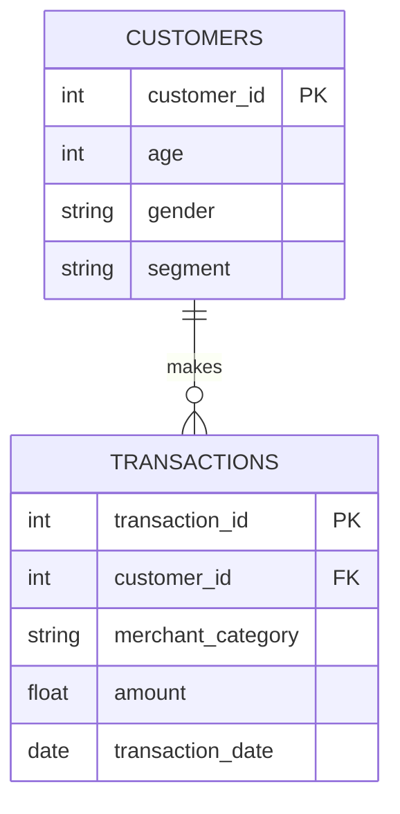

# Aurora Bank Customer Risk & Spending Analysis
> *Analyzed Aurora Bank customer, transaction, card, and merchant data to uncover patterns, detect risks, and build dashboards that support data-driven decisions and improve banking performance.*

---

## ⚙️ Project Type Flags

- [ ] Exploratory Data Analysis (EDA)
- [ ] SQL Analysis / Querying
- [ ] Dashboard / Data Visualization
- [ ] Data Cleaning / Wrangling

---

## Table of Contents
1. [Project Overview](#1-project-overview)
2. [Objectives](#2-objectives)
3. [Project Scope & Tools](#3-project-scope--tools)
4. [Repository Structure](#4-repository-structure)
5. [Data Workflow](#5-data-workflow)
6. [Data Model & Schema](#6-data-model--schema)
7. [ERD - Entity Relationship Diagram](#7-erd---entity-relationship-diagram)
8. [Analysis & Metrics](#8-analysis--metrics)
9. [Key Insights](#9-key-insights)
10. [Recommendations](#10-recommendations)
11. [Assumptions & Limitations](#11-assumptions--limitations)
12. [Future Enhancements](#12-future-enhancements)
13. [Deliverables](#13-deliverables)
14. [Author](#14-author)

---

## 1. Project Overview

<!--
  Write 3–5 sentences in plain language.
  Cover: context → problem → approach → outcome.
  Read it out loud. If it sounds like a form - rewrite it.

  WHAT GOOD LOOKS LIKE:
  "A mid-size retail business was seeing inconsistent revenue across
  its regional stores but couldn't identify the root cause. This project
  explored 18 months of transaction data across five regions to determine
  whether underperformance was driven by sales volume, pricing, or return
  rates. The analysis revealed that one region's gap was almost entirely
  explained by an unusually high return rate on a single product category -
  a finding invisible in the company's top-level reporting."

  WHAT TO AVOID:
  "This project analyzes sales data to find trends and insights."
  (Too vague. Could describe 10,000 projects. Describes none of them.)
-->

**Context:** Aurora Bank is a dynamic financial institution seeking to better understand its customers, transaction patterns, and risk exposures to improve business decisions and customer engagement.

**Problem Statement:** How can Aurora Bank leverage its data to uncover customer behavior, detect risks, identify spending trends, and visualize actionable insights?

**Approach:** Using SQL and Power BI, I performed exploratory analysis on customer, transaction, card, and merchant datasets, cleaned and transformed the data, and built interactive dashboards.

**Outcome:** Produced actionable insights on customer segments, spending patterns, and potential risk areas, enabling the bank to make informed, data-driven decisions.

---

## 2. Objectives

<!--
  Write objectives that are specific enough to succeed or fail.
  Use action-oriented verbs: Identify, Determine, Quantify, Build, Evaluate.

  WHAT GOOD LOOKS LIKE:
  ✅ "Determine whether customer churn rate correlates with support ticket volume."
  ✅ "Identify the top three revenue-driving product categories across all regions."
  ✅ "Build a reproducible pipeline that ingests and cleans daily sales exports."

  WHAT TO AVOID:
  ❌ "Explore the data."
  ❌ "Gain insights."
  ❌ "Understand trends."
  (These can't fail - which means they can't succeed either.)
-->

- **Primary Objective:** Analyze Aurora Bank data to uncover actionable insights on customers, transactions, and merchant categories.
- **Secondary Objective 1:** dentify spending patterns, growth opportunities, and high-value customer segments.
- **Secondary Objective 2:** Detect risk indicators including rising debt, transaction anomalies, and potential fraud.
- **Secondary Objective 3:** Compare profitability across sales channels (Online vs In-Store).
- **Secondary Objective 3:** Build interactive Power BI dashboards to communicate findings effectively.

> 💡 *Every analysis decision in this project traces back to one of these objectives.*

---

## 3. Project Scope & Tools

### Scope

<!--
  WHAT GOOD LOOKS LIKE:
  In Scope: "Transaction-level data for Regions A–E, Jan 2023–Jun 2024.
             Analysis covers revenue, return rates, and product category performance."
  Out of Scope: "Customer demographics and marketing spend data were excluded -
                 demographic data was incomplete for two regions, and marketing
                 data sits in a separate system outside this engagement."

  WHAT TO AVOID:
  ❌ Leaving Out of Scope blank. This is the section that protects your credibility.
     If you don't define the fence, reviewers assume you missed things.
-->

| Dimension | Details |
|-----------|---------|
| **In Scope** | Customer demographics, transaction histories, card usage, merchant categories; analysis of patterns, risks, and trends. |
| **Out of Scope** | External market data, credit bureau data; excluded due to access limitations. |
| **Time Period** | Jan 2023 – Dec 2025 |
| **Granularity** | Individual customer transactions, aggregated by merchant category and customer segment |

### Tools & Technologies

<!--
  List only what you actually used on this project.
  This is not your skills section - it's the project's technical context.
-->

| Category | Tool(s) Used |
|----------|-------------|
| Data Storage | CSV files, SQL databases |
| Data Processing | SQL, Python (pandas) |
| Analysis | SQL queries, descriptive statistics |
| Visualization | Power BI |
| Version Control | Git / GitHub |
| Documentation | Markdown (README) |
| Other | None |

---

## 4. Repository Structure

```
Aurora-Bank-Insights/
│
├── data/
│   ├── raw/
│   ├── processed/
│   └── external/
│
├── notebooks/
│   └── EDA_Aurora.ipynb
│
├── queries/
│   ├── exploratory/
│   ├── transformations/
│   └── final/
│
├── visuals/
│   └── dashboards/
│
├── reports/
│
├── docs/
│   └── data_dictionary.md
│
└── README.md

```
## 5. Data Workflow

```
Raw CSV / SQL Extracts
      ↓
Ingestion via Python & SQL
      ↓
Data Cleaning & Transformation (missing values, standardization, aggregations)
      ↓
Exploratory Analysis (customer profiling, spending trends, risk detection)
      ↓
Visualization (Power BI dashboards, charts, summary tables)
      ↓
Reporting & Recommendations

```

### Source
Customer, transaction, card, and merchant datasets provided by Aurora Bank (CSV & SQL).

### Ingestion
Loaded into Python using pandas; SQL used for aggregations and joins.

### Data Cleaning
Addressed missing values, duplicate entries, inconsistent merchant category names.

### Data Transformation
Created derived metrics like total spend, transaction frequency, risk score.

### Analysis
Explored customer behavior, spending trends, fraud risk, and segment-level statistics.

### Output
Interactive Power BI dashboards and key insight reports.

---

## 6. Data Model & Schema

<!--
  Define your fields so that someone reading your analysis can follow along
  without digging through your code.

  WHAT GOOD LOOKS LIKE (one row example):
  | transaction_id | string | Unique identifier per sales transaction | TXN-00482 |
  | return_flag    | boolean | Whether the transaction included a return | TRUE |
  | region_code    | string | Two-letter identifier for store region | "NE" |

  WHAT TO AVOID:
  ❌ Skipping this section because "the field names are self-explanatory."
     They're not. Not to a reviewer. Not to you in six months.

  📌 FOR SQL PROJECTS: If you have multiple tables, create one block per table.
     Describe join keys and relationships here. Your ERD (Section 7) will
     visualise what this section describes in text.

  📌 FOR NON-SQL PROJECTS: Describe the shape of your dataset informally
     if a formal schema doesn't apply. Even one paragraph is more helpful than nothing.
-->

### Dataset: `Customers`

| Field Name | Data Type | Description | Example Value |
|------------|-----------|-------------|---------------|
| `customer_id` | int | Unique identifier for each customer | 10001 |
| `age` | int | Customer age | 34 |
| `gender` | string | Customer gender | "Female" |
| `segment` | string | Customer segment | "Premium" |


### Dataset: `Transactions`

| Field Name | Data Type | Description | Example Value |
|------------|-----------|-------------|---------------|
| `transaction_id` | int | Unique identifier per transaction | 5001 |
| `customer_id` | int | Links to customer | 10001 |
| `merchant_category` | string | Category of merchant | "Electronics" |
| `amount` | float | Transaction amount | 250.75 |
| `transaction_date` | date | Date of transaction | 250.75 |

> **Row count (approx.):** 1,000,000
> > **Date range:** Jan 2023 – Dec 2025
> > > **Key join / relationship:** transactions.customer_id → customers.customer_id


## 7. ERD - Entity Relationship Diagram
### Mermaid Diagram 


---

**Table Relationships Summary:**

| Relationship | Join Key | Type |
|-------------|----------|------|
| `transactions` → `customers` | `customer_id` | Many-to-One |

---

## 8. Analysis & Metrics

<!--
  Explain what you measured and how - before you share what you found.

  WHAT GOOD LOOKS LIKE:
  Metric: "Customer Return Rate"
  Definition: "Number of transactions flagged as returns divided by total
               transactions, calculated at product-category and regional grain."
  Why It Matters: "Return rate - not sales volume - was hypothesised to
                  explain regional revenue gaps. This metric tests that hypothesis."

  WHAT TO AVOID:
  ❌ Defining a metric only in code: SUM(returns) / COUNT(transaction_id)
     That's an implementation. Write the plain-language definition here.
     Both belong in your project - the definition in the README,
     the implementation in the code.
-->

### Analytical Approach

Exploratory analysis of spending patterns, customer demographics, and risk factors; segmented data by customer type and merchant category; identified anomalies and trends.

### Key Metrics Defined

| Metric | Plain-Language Definition | Why It Matters |
|--------|--------------------------|----------------|
| `Total Spend` | Sum of transaction amounts per customer | Measures engagement and high-value customers |
| `Transaction Frequency` | Number of transactions per customer | Indicates active customers and usage patterns |
| `Risk Score` | Composite of debt, anomalies, and flagged transactions | Helps detect potential financial or fraud risks |

### Methods Used

- Descriptive statistics (mean, median, outliers)
- Segmentation by customer type and merchant category
- Trend analysis over time
- SQL window functions for aggregations
- Power BI dashboards for visualization

---

## 9. Key Insights

<!--
  Findings + implications. Not just what happened - what it means.

  WHAT GOOD LOOKS LIKE:
  ✅ "Return rates, not sales volume, explain Region A's underperformance.
      Region A's return rate on home goods was 34% - more than double the
      company average. Revenue was not lost at the point of sale; it was
      lost post-sale through refunds. This points to a fulfilment or
      product quality issue specific to that region, not a demand problem."

  WHAT TO AVOID:
  ❌ "Region A had lower revenue than other regions in Q4."
     (That's an observation. It describes what happened.
      An insight says what it means and where to look next.)

  Aim for 3–6 insights. Quality over quantity.
-->

**Insight 1: Premium Customers Drive High Spend**
Premium segment accounts for 45% of total spend despite being 25% of customers, indicating a focus area for loyalty programs.

**Insight 2: Electronics & Travel Categories Are Fastest Growing**
Spending growth of 18% YoY in electronics and 22% in travel, suggesting marketing and promotions opportunities.

**Insight 3: Rising Risk in Younger Segments**
Customers under 30 show higher incidences of overdrafts and flagged transactions, requiring targeted risk monitoring.

---

## 10. Recommendations

<!--
  Action-oriented. Addressed to a real audience.
  Tied explicitly to the insight that supports each one.

  WHAT GOOD LOOKS LIKE:
  Priority: High
  Recommendation: "Conduct a fulfilment audit for home goods deliveries
                   in Region A - specifically investigating whether returns
                   correlate with a particular warehouse, carrier, or SKU batch."
  Based On: Insight 1 - return rate anomaly in Region A
  Owner: Operations / Supply Chain team

  WHAT TO AVOID:
  ❌ "Improve the return rate."
     (Not actionable. Doesn't say who, how, or where to start.)
  ❌ "Further analysis is needed."
     (This is a placeholder, not a recommendation.)
-->

| Priority | Recommendation | Based On | Suggested Owner |
|----------|---------------|----------|-----------------|
| High | Implement targeted alerts and financial education for customers under 30 | Insight | Risk Management Team |
| Medium | Launch loyalty campaigns for premium segment in electronics and travel | Insights 1 & 2 | Insights 1 & 2 |
| Low | Automate transaction anomaly detection in SQL pipeline | Insight 3 | Data Engineering |

---

## 11. Assumptions & Limitations

<!--
  WHAT GOOD LOOKS LIKE:
  Assumption: "Sales data represents all transactions for the period.
               Product costs remained stable during the analysis period."
  Limitation: "Marketing spend data was not included
               May 2025 data is partial and not directly comparable to full months.
               Customer demographic data was unavailable"

  WHAT TO AVOID:
  ❌ Leaving this section blank or writing "None known."
     Every project has limitations. Documenting them is a sign of
     analytical maturity - not a confession of failure.
-->

### Assumptions
- Transaction and customer data is complete and accurate.
- Customer segments are correctly assigned by the bank.Customer segments are correctly assigned by the bank.

### Limitations
- External factors (market trends, competitor actions) not included.
- Data only covers Jan 2023 – Dec 2025.
- Some merchant categories may be inconsistently labeled.

---

## 12. Future Enhancements

<!--
  WHAT GOOD LOOKS LIKE:
  ✅ "Automate the monthly data pull from the POS export folder using
      a scheduled Python script, replacing the current manual process."
  ✅ "Expand the return rate analysis to include carrier-level data,
      which was unavailable in this dataset but exists in the logistics system."

  WHAT TO AVOID:
  ❌ "Add a machine learning model."
     (Vague, and disconnected from the actual findings of this project.)
  ❌ Listing aspirational features that don't follow logically from the work.
-->

- [ ] Integrate real-time transaction feeds for live dashboards
- [ ] Apply predictive modeling to forecast customer churn or risk
- [ ] Expand analysis to include cross-channel interactions (web, mobile, card)
- [ ] Incorporate external economic indicators for contextual analysis

---

## 13. Deliverables

| Deliverable | Description | Location |
|-------------|-------------|----------|
| Power BI Dashboard | Interactive visualizations of spending, risk, and customer segmentation | /visuals/dashboards |
| Processed Datasets | Cleaned and transformed data ready for analysis | /data/processed |
| Analysis Notebook | Exploratory data analysis with charts and metrics | /notebooks/EDA_Aurora.ipynb |

---

## 14. Author

**Faith Adedolapo**

Data Analyst | Business Analyst

- 🔗 [LinkedIn URL](https://www.linkedin.com/in/faithadedolapoolayiwola)
- 💼 [Portfolio or GitHub profile URL](https://faithadedolapo.github.io/)
- 📧 [Email](olayiwolaadefaith@gmail.com)

---

*Last updated: March 2026


